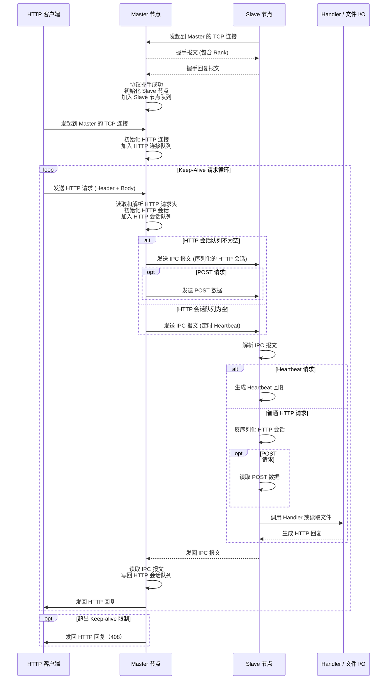
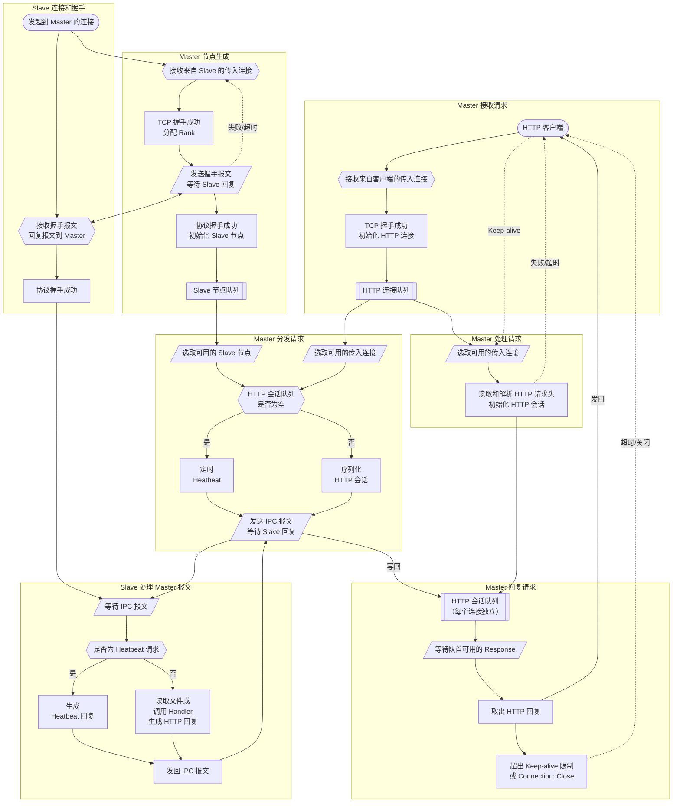

# CovScript NetUtils 协议文档

版本：1.2.0

作者：Covariant Script OSC

## 1. 概述

**CovScript-NetUtils** 是一个以异步 I/O 为基础，支持单机（多纤程）和主从多进程（Master–Slave）两种运行模式的轻量 HTTP 服务框架。设计上偏向高并发 I/O 场景并支持将计算密集型或有状态处理下放到外部 Slave 进程，从而提升吞吐和隔离性。

两种运行模式简述：

* **单机模式（Single Process）**
  多个 fiber 在同一进程内并发接受并处理 HTTP 请求（包括静态文件、绑定的 handler）。适合 I/O 密集型场景（大量静态文件/代理请求）。

* **多进程模式（Master–Slave）**
  Master 负责接收客户端连接、维护每个连接的请求队列、调度空闲 Slave 执行请求并接收响应；Slave 负责反序列化请求、执行业务（handler 或 文件读取）、并将响应发回 Master。适合把耗 CPU、需隔离或依赖外部运行环境的业务放到 Slave 里执行的场景。

设计目标摘要：

* 异步 I/O + fiber 协程模型
* 支持 HTTP/1.1 Keep-Alive（单连接多请求）
* Master↔Slave 之间使用**固定长度头（16 字节 ASCII 十六进制） + 数据体**的简单 IPC 编码（避免每包传输长度不确定）
* 保证同一 TCP 连接内请求顺序不被打乱（即便在多个 Slave 并行执行也能按连接顺序返回）
* 可横向扩展多个 Slave 以提升并发处理能力

## 2. 基本常量与工具函数

* `server_name = "CovScript-NetUtils"`
* `server_version = "1.2.0"`

与协议/实现相关的重要工具函数：

* `send_content(sock, content)`
  将 `content` 发到 socket，框架在发送端会先输出 16 字节的 ASCII 十六进制长度（通过 `to_fixed_hex`），后跟 `content` 本体：

  ```
  [16字节十六进制长度][实际数据]
  ```

  例：`000000000000002A` + `<42 bytes payload>`

* `receive_content(sock)` / `receive_content_s(sock, timeout)`
  接收 16 字节长度头并读取对应字节数的数据；`receive_content_s` 带超时处理并返回 `{error_code, data}` 样式（发生超时或错误时返回错误码）。

* `compose_http_time()`
  生成 RFC 风格的 GMT 时间字符串用于 HTTP Date 头。

* `compose_response(code)`
  快速构造最小化的 HTTP 响应（`Connection: close` + `Content-Length: 0`），用于发生错误时直接回写给客户端。

* 路径和 MIME 相关：`path_normalize(path)`, `get_mime(path)`，默认 MIME 未匹配时返回 `application/octet-stream`。

* URL/参数解析：`url_decode(s)`, `parse_http_args(input)`。`parse_http_args` 支持重复键并把多个值变成数组。

## 3. IPC 帧格式（Master ↔ Slave）

所有 Master ↔ Slave 的消息使用相同的“16 字节 ASCII 十六进制长度前缀 + 数据体”帧格式：

* 前缀：16 字节 ASCII 十六进制，表示随后数据体的字节长度（例如 `"000000000000002A"` 表示 42 bytes）。
* 数据体：任意字节流（通常为 UTF-8 文本）。对于请求分发为 JSON（`http_session.serialize()` 生成），若是 POST 请求，POST body 会紧接着由发送方单独写入（master 在 dispatch 时会发送序列化 JSON，然后 `async.write(node->sock, session.post_data)` 发送 POST body）。

示例发送步骤（Master -> Slave，POST）：

1. Master: `send_content(sock, session.serialize())`  // 发送 JSON 描述
2. Master: `async.write(sock, session.post_data)`     // 发送 POST 数据（长度由 JSON 中的 content_length 指定）

Slave 在接收端做：

1. `receive_content_s` 得到 JSON，反序列化为 `http_session`（`session.deserialize(data)`）
2. 若 `method == "POST"`，再读取 `session.content_length` 字节为 `session.post_data`。

## 4. HTTP Session 格式（JSON）

Master 与 Slave 之间用 JSON 表示请求（由 `http_session.serialize()` / `deserialize()` 实现）：

```json
{
  "url": "/example",
  "args": "id=1",
  "host": "127.0.0.1",
  "method": "GET",
  "version": "1.1",
  "connection": "keep-alive",
  "content_length": 0
}
```

字段说明：

| 字段               | 含义                                           |
| ---------------- | -------------------------------------------- |
| `url`            | 请求路径（例如 `/`、`/api/x`）                        |
| `args`           | URL 查询部分（未解析为 map 的原始字符串）                    |
| `host`           | Host 头                                       |
| `method`         | HTTP 方法（如 `GET` / `POST`）                    |
| `version`        | HTTP 协议版本（如 `1.0`, `1.1`）                    |
| `connection`     | `keep-alive` 或 `close`                       |
| `content_length` | 当 `method == "POST"` 时表示随后的 POST body 长度（字节） |

注意：`post_data`（POST 的主体）**不包含在 JSON 里**，以减少 JSON 编/解码开销；发送端在序列化 JSON 后紧跟二进制 POST 数据发送（见上节 IPC 帧格式）。

## 5. Master ↔ Slave 协议流程细节

### 5.1 握手（Handshake）

当 Slave 连接 Master 后，握手按文本协议进行（使用同样的 send_content/receive_content）：

* Master 发送：`"SERVER <server_version> <rank>"`

* Slave 回复：`"WORKER <server_version> <rank>"`

Master 分配 `rank`：先尝试使用 `deprecated_rank`（回收的编号），否则以当前 `slave_list.size` 作为新编号。版本号必须匹配（否则视为握手失败）。

握手成功后，`node->state = 0` 表示空闲可用。

### 5.2 状态定义（Slave / connection 等）

| 状态值  | 含义            |
| ---- | ------------- |
| `-1` | 错误 / 已断开（不可用） |
| `0`  | 已连接且空闲（ready） |
| `1`  | 忙碌（busy）      |

（Master 的 `http_conn.state` 使用：`-1`=closed, `0`=established, `1`=busy）

### 5.3 心跳（Health Check）

* Master 空闲时会定期（`heartbeat_interval`，默认 1000 ms）发送 `"SLAVE_HEALTH_QUERY"`；期望收到 `"SLAVE_HEALTH_CONFIRM"`。
* 若超时或收到错误，Master 将关闭该 Slave 并把其 `state` 标记为 `-1`，移入回收流程。

### 5.4 请求分发（Dispatch）流程（核心保证顺序的机制）

1. Master 在 `master_dispatch_worker` 中选出一个空闲 `node`（`node->state == 0`）。
2. Master 在 `conn_list` 中寻找某个 `http_conn` 其 `request_idx < request_queue.size`（表示该连接有未派发且未完成请求）。
3. 对该 `conn`：`session = conn->request_queue[conn->request_idx++]`（取出并**标记为已派发**），`send_content(node->sock, session.serialize())`（发送**序列化的 HTTP Session 数据**）；若为 `POST` 则随后 `async.write(node->sock, session.post_data)`（发送 POST 数据）。此时把 `node->state = 1`（busy）。
4. Slave 反序列化，并执行 `call_http_handler(session, server)`（会调用绑定的 handler 或静态文件读取），把响应构造好后用 `send_content()` 发回 Master。
5. Master 在 `master_dispatch_worker` / `master_response_worker` 读取到响应后，将字符串写入对应连接的输出流（`async.write(conn->sock, session.response)`），随后执行：

   ```text
   conn->request_queue.pop_front()
   --conn->request_idx
   ```

   这样保证：

   * 队首的请求被移除（pop_front）
   * `request_idx` 自减以保持索引一致（因为之前我们为已派发的请求做了自增）
     因而**保证同一 TCP 连接内请求按队列顺序完成**，即便多个请求被并发派发到不同 Slave。

备注：如果 dispatch/读取响应过程中出现 Slave 超时/错误，Master 会把 `session.response` 设置为由 `compose_response(error_code)` 构造的错误响应并回写给客户端，同时把该 Slave 标记为 `-1` 并关闭。

## 6. 常用配置与默认值

`http_server` 的常用配置与默认值（代码中的初始值）：

| 配置项                        |                                   含义 |   默认值  |
| -------------------------- | -----------------------------------: | :----: |
| `worker_count`             |                      每进程启动的 worker 数 |   `4`  |
| `max_keep_alive`           |                          每连接允许的最大请求数 |  `100` |
| `keep_alive_timeout`       |                      保持连接的最大空闲时间（ms） | `5000` |
| `max_connections`          |                    Master 接入的最大并发连接数 |  `100` |
| `master_worker_count`      |        Master 模式下并发 request worker 数 |   `4`  |
| `heartbeat_interval`       |              Master 对 Slave 心跳间隔（ms） | `1000` |
| `slave_spawn_timeout`      |                     Slave 握手超时时间（ms） | `1000` |
| `slave_keep_alive_timeout` | Master 与 Slave 之间的 keep-alive 超时（ms） | `5000` |

控制逻辑：

* 若某连接空闲时间超过 `keep_alive_timeout`，Master 会在关闭前尝试回写 `408 Request Timeout`（或直接关闭）。
* 若单条连接处理的请求数超过 `max_keep_alive`，Master 会主动向客户端发送 `408` 并关闭连接。
* Slave 的请求处理若超时（`receive_content_s` 超时），Master 将用错误码构造响应并关闭该 Slave 连接。

## 7. 静态文件服务与安全（wwwroot、path_normalize）

* `http_server.set_wwwroot(path)`：设置静态文件根目录（`wwwroot_path`），实现会正则化路径（`path_normalize`），并在读取文件前检查 `full_path.find(base_path, 0) == 0`（确保 `full_path` 位于 `wwwroot` 内），否则返回 `403 Forbidden`。
* 目录请求：若解析到目录且尾部没有 `/`，实现会追加 `/index.html` 并尝试返回 `index.html`。
* 文件读取采用缓存：`mtime_map`、`content_map` 用于根据文件修改时间缓存内容（`read_file(path)` 会对比 `system.file.mtime(path)`，若未变化直接返回缓存内容）。

**MIME 映射表（内置）**

| 扩展名             | MIME                       |
| --------------- | -------------------------- |
| `.html`, `.htm` | `text/html`                |
| `.txt`          | `text/plain`               |
| `.js`           | `application/javascript`   |
| `.css`          | `text/css`                 |
| `.png`          | `image/png`                |
| `.jpg`, `.jpeg` | `image/jpeg`               |
| `.gif`          | `image/gif`                |
| `.json`         | `application/json`         |
| Not Found       | `application/octet-stream` |

可以通过 `netutils.mime_map["文件扩展名"] = "MIME字符串"` 在运行服务之前扩展未知的文件 MIME。

## 8. API 与常用方法

`http_server` 类是主对外入口，常用方法：

* `set_wwwroot(path : string)`
  设置静态文件根目录（并 normalize），返回 `this` 以链式调用。

* `set_config(conf : hash_map)`
  通过 `hash_map` 设置多个配置项，通常将 JSON 配置文件读取后传至这里，返回 `this`。

* `bind_page(url : string, path : string)`
  将某 URL 绑定到 `wwwroot/path`，当请求到该 URL 时返回该文件内容。

* `bind_code(state_code, path : string)`
  将错误状态码（`netutils.state_codes.code_xxx`）绑定到特定文件（便于自定义 404/403 页面）。

* `bind_func(url : string, func : function)`
  绑定自定义 handler 函数到某 URL（`func(server, session)`）。

* `set_master(port : integer)`
  启用多进程模式，并将当前实例配置为 Master ，在本地监听 `port`。

* `set_slave(ip : string, port : integer)`
  启用多进程模式，并将当前实例配置为 Slave 并在启动时连接 Master 的 `ip:port`。

* `listen(port : integer)`
  启动单进程模式，并在本地监听 `port`。

* `poll()`
  启动服务（非阻塞），仅轮询一次。需循环调用才能使服务正常运行。

* `run()`
  启动服务（阻塞），适合守护进程模式。

---

## 9. 单进程（simple_worker）与多进程（master/slave）Worker 行为

* **simple_worker**（单进程）
  `simple_worker` 在 accept 到 client socket 后进入处理循环：读取请求头（`read_http_header`），若为 POST 则读取 body；调用 `call_http_handler(session, server)` 执行 handler；根据 `keep-alive` 决定是否关闭连接或继续读取下一个请求。

* **master_spawn_worker / master_accept_worker / master_request_worker / master_dispatch_worker / master_response_worker**（Master 模式）
  Master 逻辑拆成若干 fiber：

  * Accept Worker：接收新的客户端连接并把 `http_conn` 放入 `conn_list`。
  * Request Worker：从 `conn_list` 中挑选一个处于 `state == 0` 的 `http_conn`，读取 header 并把 `session` push 到 `request_queue`。
  * Dispatch Worker：为空闲 Slave 分配 `conn->request_queue[conn->request_idx]` 并发送。
  * Response Worker：负责把 Slave 返回的响应写回客户端 socket，并在必要时关闭连接与清理。

* **slave_worker**（Slave）
  循环连接 Master 并完成握手后：接收 Master 派发的 `session`（JSON），若为 POST 则继续读取 POST 数据，调用 `call_http_handler(session, server)` 执行，执行完将响应用 `send_content()` 写回 Master。

---

## 10. 错误码与异常处理

| 状态码                         | 含义                        |
| --------------------------- | ------------------------- |
| `200 OK`                    | 正常响应                      |
| `400 Bad Request`           | 请求头格式错误或解析失败              |
| `403 Forbidden`             | 资源访问受限（如越界的 wwwroot）      |
| `404 Not Found`             | 资源不存在                     |
| `408 Request Timeout`       | Keep-Alive 超时或 Slave 响应超时 |
| `500 Internal Server Error` | 服务器内部错误                   |
| `503 Service Unavailable`   | 无可用 Slave / 负载过高（可由用户自定义） |
| `000 End of file`           | 流提前结束（EOF）                |

实现备注：

* `read_http_header` / `read POST body` 等函数会识别 `state.eof()` 并记录 EOF 情况，Master/Slave 会据此决定是否回写错误并关闭 socket。
* Master 在某些错误（非 EOF）情况下会直接用 `async.write(sock, compose_response(error_code))` 回写客户端。

---

## 11. 辅助网络接口

* `http_get(url)` / `http_post(url, post_fields)`：基于内部 `curl` 封装的简单 HTTP 客户端，受 `proxy`, `timeout_ms`, `low_speed_limit` 全局变量控制（若未设则使用默认行为）。这适用于框架内部需要发起外部请求的场景。

* `local_addr()`：使用 UDP connect 到 `8.8.8.8:53` 来探测本机公网/本地出口地址（不发送数据，只用 socket local endpoint）。

---

## 12. 参数与配置示例

示例：启动一个单进程静态文件服务器并绑定自定义 URL：

```covscript
import netutils

var server = new netutils.http_server
server.set_wwwroot("/var/www/html")
      .set_config({"worker_count": 8, "keep_alive_timeout": 7000})
      .bind_page("/", "index.html")
      .bind_func("/ping", [](s, session) {
          session.send_response(state_codes.code_200, "pong", "text/plain")
      })
      .listen(8080)
      .run()
```

示例：Master + Slave 模式（在 Master 端）：

```covscript
import netutils

var master = new http_server
master.set_master(9000)
      .set_wwwroot("/var/www/html")
      .listen(8080)
      .run()
```

在 Slave 端：

```covscript
import netutils

var slave = new netutils.http_server
slave.set_slave("127.0.0.1", 9000)
     .set_config({"worker_count": 2})
     .run()
```

## 13. 安全性与常见注意事项

* **路径归一化**（`path_normalize`）会把路径分隔符统一，处理 `..`，并保证最终 `full_path` 必须以 `wwwroot` 前缀开头，否则返回 `403`。仍建议在部署时把 `wwwroot` 指向只读目录并严格设置文件权限。
* **POST Body 处理**：Master/Slave 之间传输 POST Body 时依赖 `content_length`，若客户端或中间链路错误导致长度不匹配，会引发阻塞或提前 EOF，要在应用层做好验证（如 Content-Length 校验）。
* **版本兼容**：Master 与 Slave 的 `server_version` 必须一致，握手会校验版本号；当升级版本时请同时升级 Master/Slave。
* **资源限制**：`max_connections` / `worker_count` / `master_worker_count` 应根据机器资源和负载曲线调整，避免出现大量 socket backlog 或内存耗尽。
* **异常恢复**：Master 会在 Slave 出现错误或心跳失败时把该 Slave 标记为 `-1` 并尝试回收其 rank，以便后续新 Slave 使用；Slave 端在崩溃后会循环重连 Master（`slave_worker` 有短时 delay 重试）。

## 14. 常见问题与调优建议

* **为什么要把 POST body 与 JSON 分开传输？**
  减少 JSON 编/解码开销与转义复杂度，同时避免在 JSON 中放大二进制数据导致解析/内存压力。

* **当 Master 的 Dispatcher 发现没有空闲 Slave 时如何处理？**
  Master 会先尝试心跳/等待空闲 Slave；如果长时间无空闲节点，派发会被延后，可能触发超时逻辑，最终由 Master 以错误码回写客户端（可自定义 503 页面 via `bind_code`）。

* **性能调优建议**

  * `worker_count` 不建议调得过高，单核能力有限，会增加调度开销。
  * Master 模式下可以单独调整 `master_worker_count` 以改善 Master 对高并发连接的处理能力。同时，`max_connections` 也需要相应更改，防止大量连接排队的情况。
  * 由于 NetUtils 依赖 Master 节点进行分发，过多的 Slave 节点也会增加系统资源和调度的开销，一般可以取 2~8。
  * 调整 `max_keep_alive`、`keep_alive_timeout` 平衡连接复用与资源占用。
  * 合理配置 `heartbeat_interval` 与 `slave_keep_alive_timeout` 保证及时发现不可用 Slave。

## 15. Master–Slave 请求处理时序图



## 16. 请求调度与队列管理流程图


