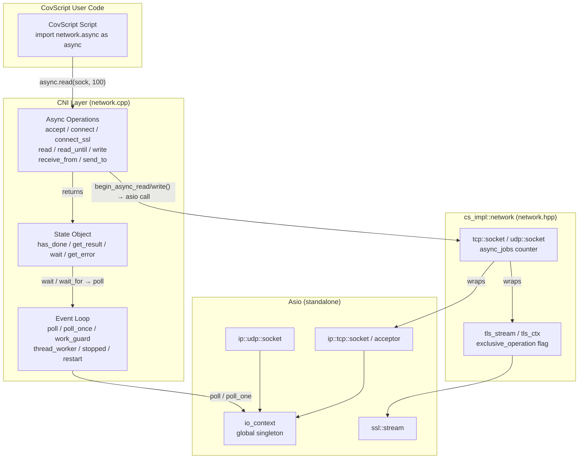
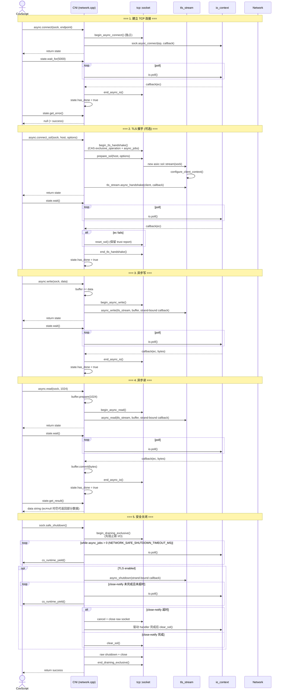
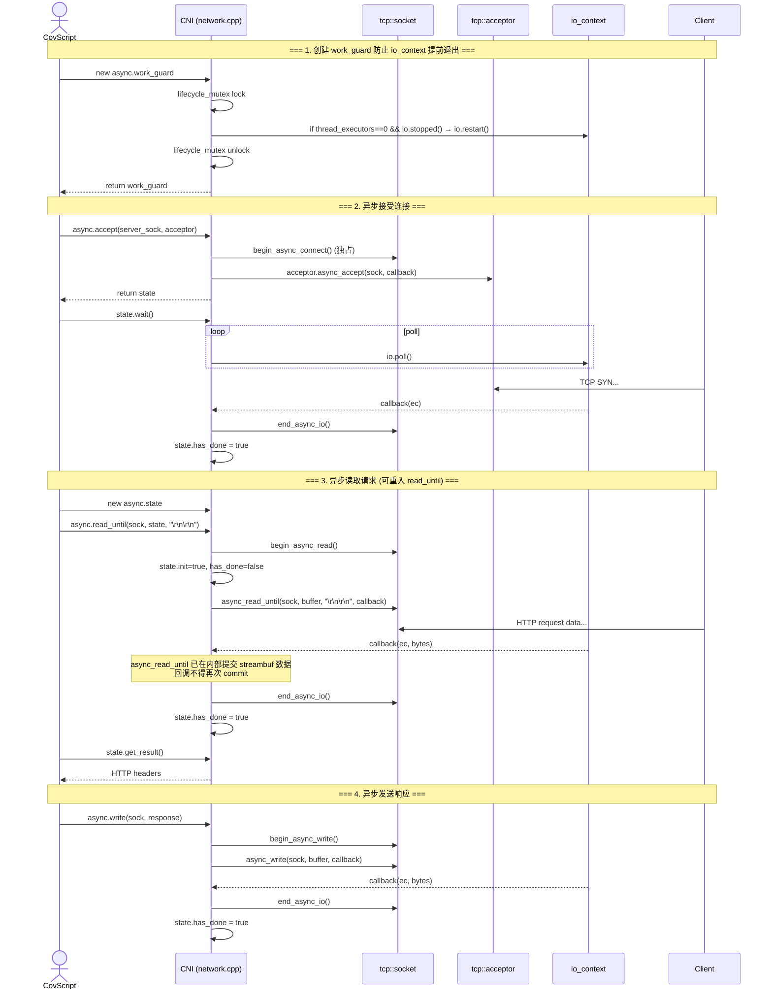
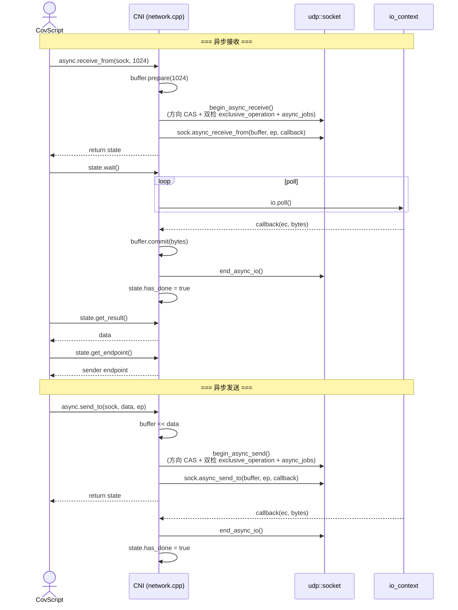
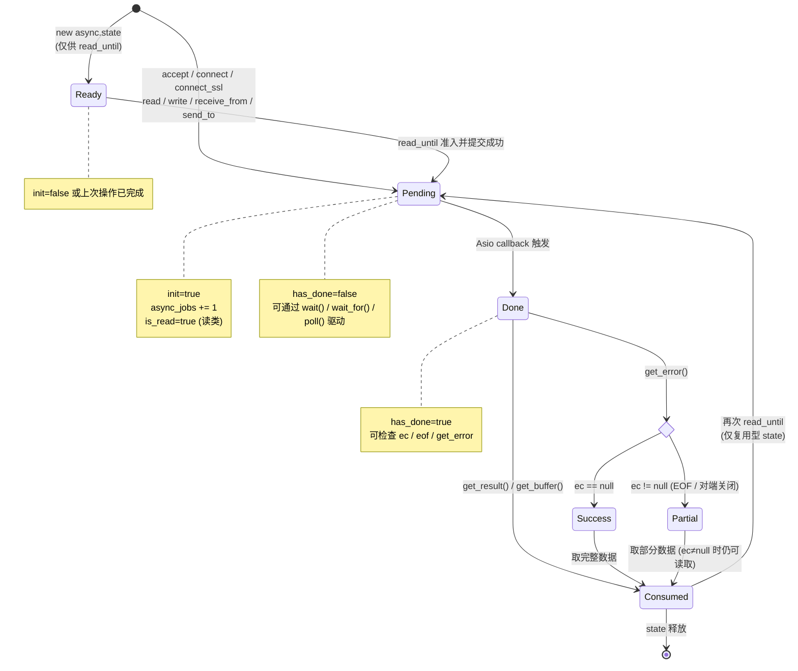
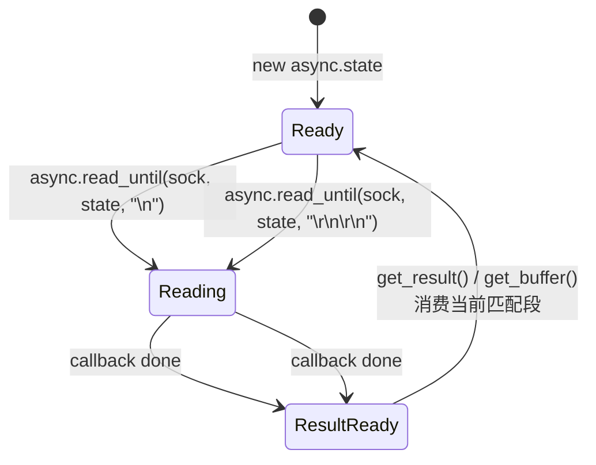
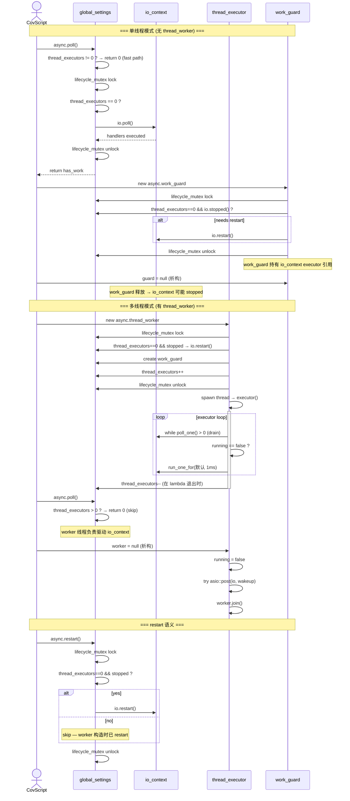
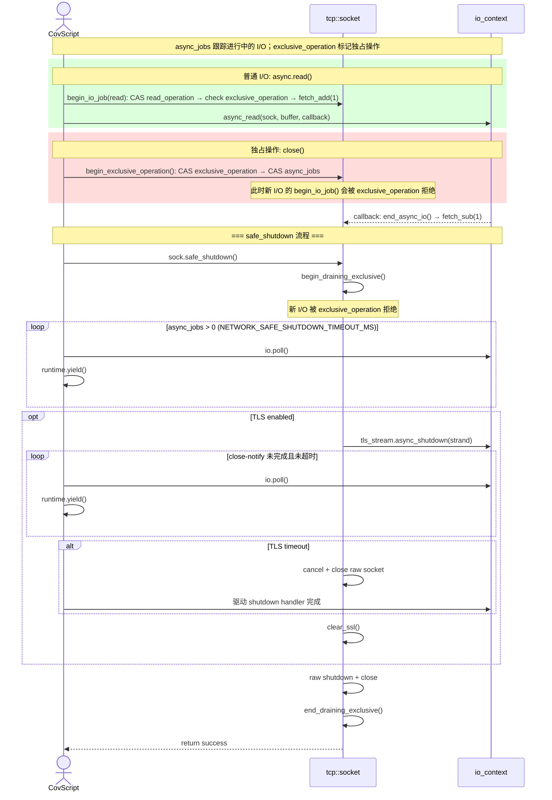
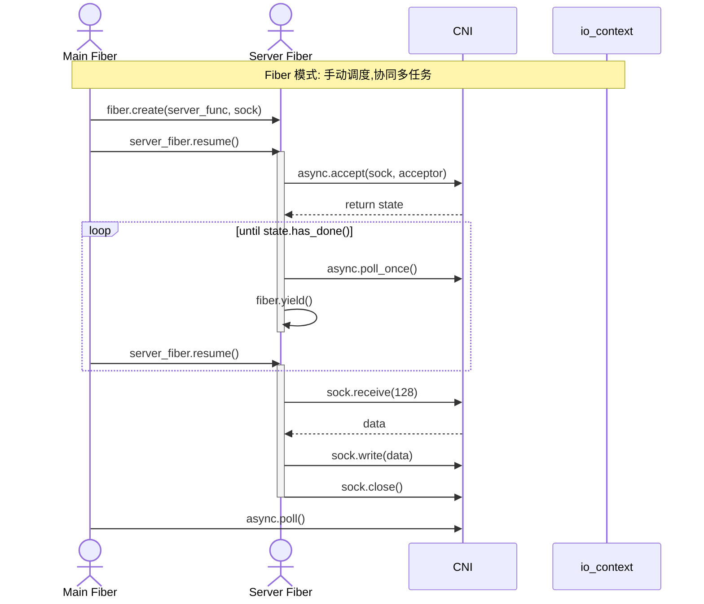

# Network Extension — Async Architecture

本文件描述了 CovScript Network Extension 中所有异步 I/O 操作的时序和生命周期。
图表使用 [Mermaid](https://mermaid.js.org/) 语法，GitHub / VS Code 均可直接渲染。

---

## 1. 整体架构

---

## 2. 异步 TCP 客户端完整流程

从 connect → TLS → write → read → shutdown 的完整时序：

---

## 3. 异步 TCP 服务端流程

---

## 4. 异步 UDP 流程

UDP 与 TCP 一样通过方向级准入跟踪异步收发，并用 `exclusive_operation` 防止 close 与新 I/O 交错。每个 socket 最多同时存在一个 receive 和一个 send；同方向重叠会被拒绝。UDP 没有 TLS，但关闭 socket 仍需要独占准入。

---

## 5. Async State 对象生命周期状态机

异步函数通常创建并返回已经进入 Pending 的 state；只有 `read_until` 接受调用方创建的 state，并允许完成后复用：

> **部分数据语义 (v1.4)**：异步读操作完成时如果 `ec != null`（例如对端关闭连接），`get_result()` 和 `get_buffer()` 仍然返回已传输的部分数据。调用者应先通过 `get_error()` / `eof()` 判断结束原因，再决定如何处理数据。

### State 对象可重入 (read_until)

`read_until` 是唯一**可重入**的异步操作。同一个 `state` 对象可在 callback 完成并消费当前匹配结果后复用；若尚未消费，streambuf 中的旧分隔符仍可能立即再次匹配。

> **失败回滚**：如果 I/O 准入失败，state 不会被修改；如果 `begin_async_read()` 成功但 `async_read_until` 发起失败（例如 `std::bad_alloc`），catch 块会恢复 `init`、`is_read`、`has_done`、`ec` 到调用前的值，state 对象保持可用。

---

## 6. 事件循环管理

> **关键变更 (v1.4)**：`poll()` 在 `thread_executors > 0` 时走无锁快路径直接返回 0，避免与 worker 线程竞争 `lifecycle_mutex`。Worker 线程的 `io.restart()` 调用已移至构造函数内（在 `lifecycle_mutex` 保护下），不再在事件循环中每轮检查。`run_one_for` 的默认等待为 1ms，可通过 CMake 的 `NETWORK_THREAD_WORKER_POLL_MS` 调整。

---

## 7. async_jobs 计数器与 exclusive_operation

### I/O 准入机制

TCP socket 的所有 I/O 操作（同步和异步）都必须通过方向级 `begin_io_job()` 或 `begin_exclusive_operation()` 准入：

| 准入方式 | 使用者 | 原子操作 | 阻塞条件 |
|---------|--------|---------|---------|
| `begin_io_job(direction)` | 普通 I/O（read/write/send/receive） | 方向 CAS + `fetch_add(1)` + 双检 `exclusive_operation` | 同方向已有操作或 `exclusive_operation == true` |
| `begin_exclusive_operation()` | TLS 握手、close、shutdown | CAS `exclusive_operation` + CAS `async_jobs` | 已有独占操作或 `async_jobs > 0` |

> **设计要点**：`close()` 和 `shutdown()` 通过 `scoped_exclusive_operation` 原子地占用 socket 独占权，防止 TOCTOU 窗口。普通 I/O 先预约 read/write 方向，再双检 `exclusive_operation`；同方向重叠直接拒绝，一读一写仍可全双工并行。TLS composed operation 的 handler 绑定到每个 socket 的 strand，多个 worker 不会并发访问同一 SSL stream。TCP `safe_shutdown()` 和 UDP `safe_close()` 的 drain 超时（默认 200ms）均通过 CMake 的 `NETWORK_SAFE_SHUTDOWN_TIMEOUT_MS` 调整。TLS close-notify 阶段的超时独立使用 `NETWORK_TLS_SHUTDOWN_TIMEOUT_MS`（默认 5000ms）。

---

## 8. 带 Fiber 的异步协作模式

---

## 9. 操作速查表

### 异步操作 (返回 state)

| 操作 | 方向 | TLS 支持 | 可重入 | I/O 准入 |
|------|------|---------|--------|---------|
| `async.accept` | 服务端 | — | ❌ | `begin_async_connect` (独占) |
| `async.connect` | 客户端 | — | ❌ | `begin_async_connect` (独占) |
| `async.connect_ssl` | 客户端 | ✅ | ❌ | `begin_tls_handshake` (独占) |
| `async.read` | 双向 | ✅ | ❌ | `begin_async_read` |
| `async.read_until` | 双向 | ✅ | ✅ (同 state) | `begin_async_read` |
| `async.write` | 双向 | ✅ | ❌ | `begin_async_write` |
| `async.receive_from` | UDP | — | ❌ | `begin_async_receive` |
| `async.send_to` | UDP | — | ❌ | `begin_async_send` |

### 同步操作

| 操作 | I/O 准入 | 说明 |
|------|---------|------|
| `connect` / `accept` | `scoped_io_job` | RAII 守卫 |
| `receive` / `read` / `send` / `write` | `scoped_io_job` | RAII 守卫 |
| `connect_ssl` | `begin/end_tls_handshake` | 独占 socket，异常路径释放预约 |
| `close` / `shutdown` | `scoped_exclusive_operation` | 独占 socket |
| `available` | `try_begin_io_job` (noexcept) | 被拒绝时返回 0 |
| `peer_closed` | `try_begin_io_job` (noexcept) | 被拒绝时返回 false；非阻塞 `MSG_PEEK` 探测对端关闭，临时切换并恢复 `non_blocking` 模式（仅影响同步操作，异步操作不受该标志影响） |

UDP 的同步 `receive_from` / `send_to` 使用 `scoped_io_job`，`close` 使用独占预约，`available` 在独占关闭期间返回 0。

### 同步等待

| 方法 | 超时 | 行为 |
|------|------|------|
| `state.wait()` | 无（直到完成） | 循环 poll + yield |
| `state.wait_for(ms)` | 自定义 | 循环 poll + yield |
| `state.has_done()` | 无 | 非阻塞检查 |

### 生命周期管理

| 对象/函数 | 作用 |
|-----------|------|
| `work_guard` | RAII 防止 io_context 因无工作而停止 |
| `thread_worker` | 后台线程持续 drive 事件循环 |
| `poll()` / `poll_once()` | 单线程模式的手动事件驱动 |
| `restart()` | 重启已停止的 io_context (需 `thread_executors==0`) |
| `safe_shutdown()` | TCP: 先原子设置 draining-exclusive 阻止新 I/O，再协作式等待 async_jobs 清零后关闭（drain 超时 `NETWORK_SAFE_SHUTDOWN_TIMEOUT_MS`，默认 200ms）。TLS close-notify 超时默认 5000ms（`NETWORK_TLS_SHUTDOWN_TIMEOUT_MS`） |
| `safe_close()` | UDP: 等待 async_jobs=0 后关闭（默认 200ms 超时，通过 `NETWORK_SAFE_SHUTDOWN_TIMEOUT_MS` 配置） |
