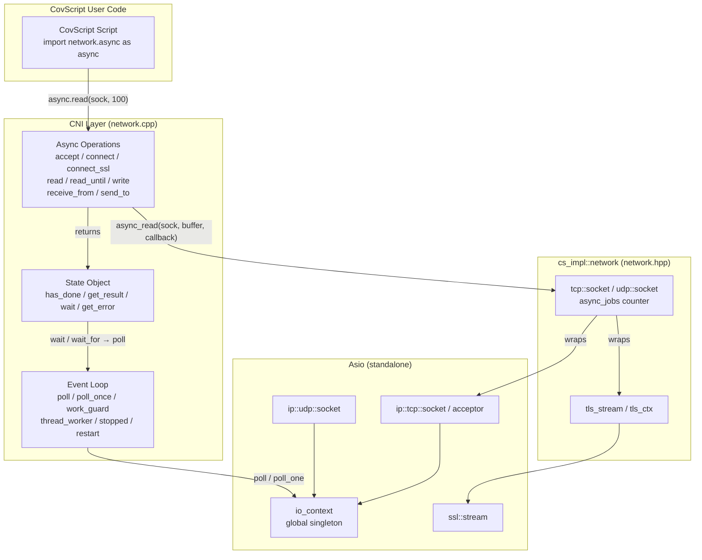
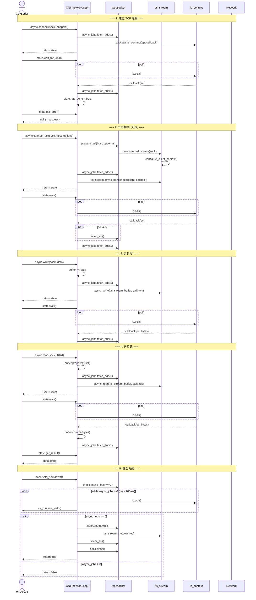
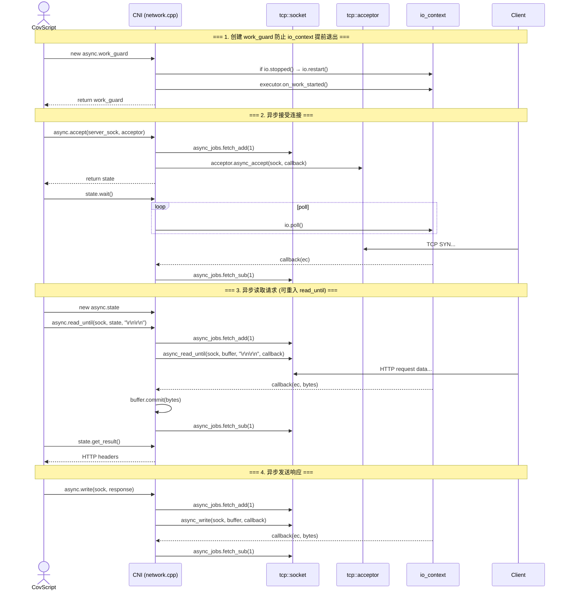
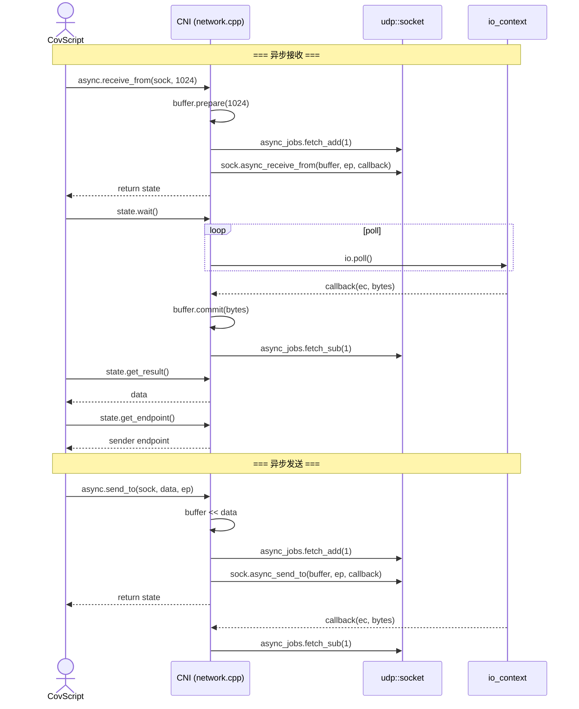
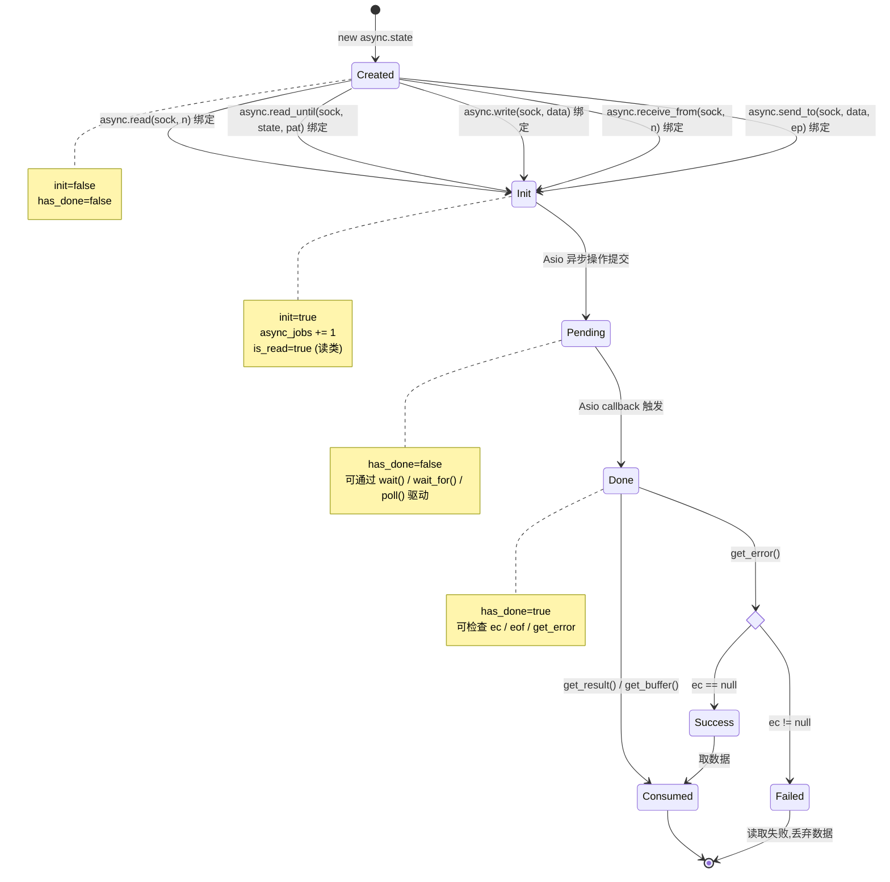
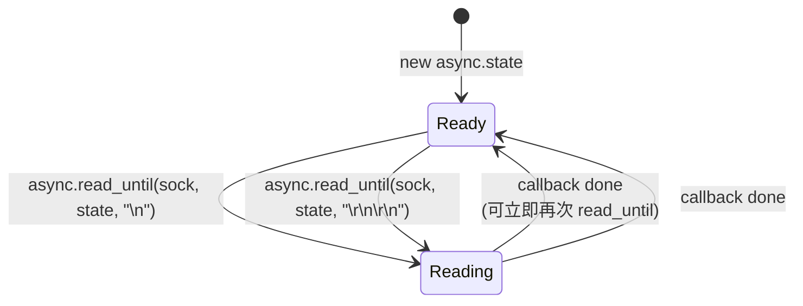
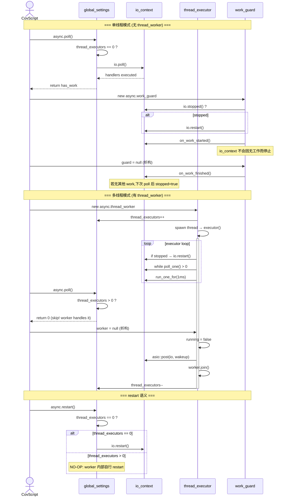
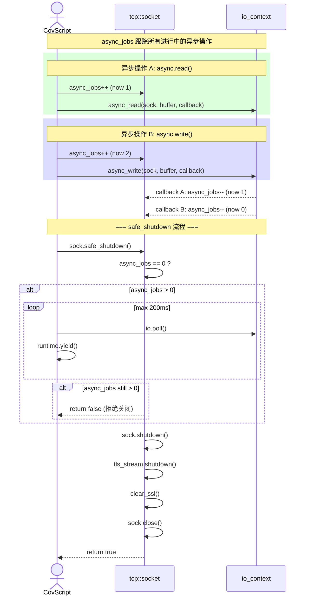
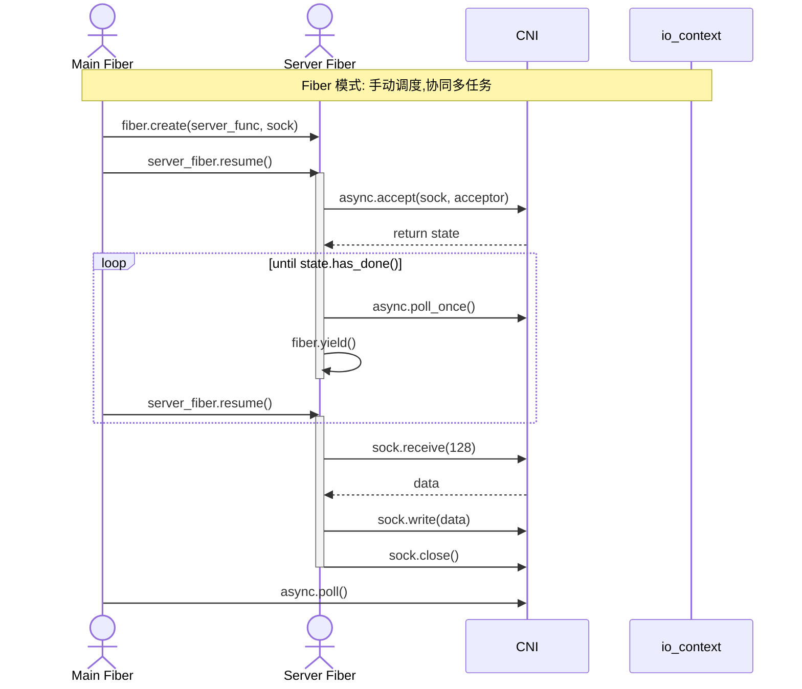

# Network Extension — Async Architecture

本文件描述了 CovScript Network Extension 中所有异步 I/O 操作的时序和生命周期。
图表使用 [Mermaid](https://mermaid.js.org/) 语法，GitHub / VS Code 均可直接渲染。

---

## 1. 整体架构

---

## 2. 异步 TCP 客户端完整流程

从 connect → TLS → write → read → shutdown 的完整时序：

---

## 3. 异步 TCP 服务端流程

---

## 4. 异步 UDP 流程

---

## 5. Async State 对象生命周期状态机

`async.state` 对象的状态转换：

### State 对象可重入 (read_until)

> `read_until` 是唯一**可重入**的异步操作——同一个 `state` 对象可以在 callback 完成后立即复用，无需创建新 state。

---

## 6. 事件循环管理

---

## 7. async_jobs 计数器和 safe_shutdown

---

## 8. 带 Fiber 的异步协作模式

---

## 9. 操作速查表

### 异步操作 (返回 state)

| 操作 | 方向 | TLS 支持 | 可重入 | async_jobs |
|------|------|---------|--------|------------|
| `async.accept` | 服务端 | — | ❌ | ✅ |
| `async.connect` | 客户端 | — | ❌ | ✅ |
| `async.connect_ssl` | 客户端 | ✅ | ❌ | ✅ |
| `async.read` | 双向 | ✅ | ❌ | ✅ |
| `async.read_until` | 双向 | ✅ | ✅ (同 state) | ✅ |
| `async.write` | 双向 | ✅ | ❌ | ✅ |
| `async.receive_from` | UDP | — | ❌ | ✅ |
| `async.send_to` | UDP | — | ❌ | ✅ |

### 同步等待

| 方法 | 超时 | 行为 |
|------|------|------|
| `state.wait()` | 30s | 循环 poll + yield |
| `state.wait_for(ms)` | 自定义 | 循环 poll + yield |
| `state.has_done()` | 无 | 非阻塞检查 |

### 生命周期管理

| 对象/函数 | 作用 |
|-----------|------|
| `work_guard` | RAII 防止 io_context 因无工作而停止 |
| `thread_worker` | 后台线程持续 drive 事件循环 |
| `poll()` | 单线程模式的手动事件驱动 |
| `restart()` | 重启已停止的 io_context |
| `safe_shutdown()` | 等待 async_jobs=0 后关闭 (200ms 超时) |
