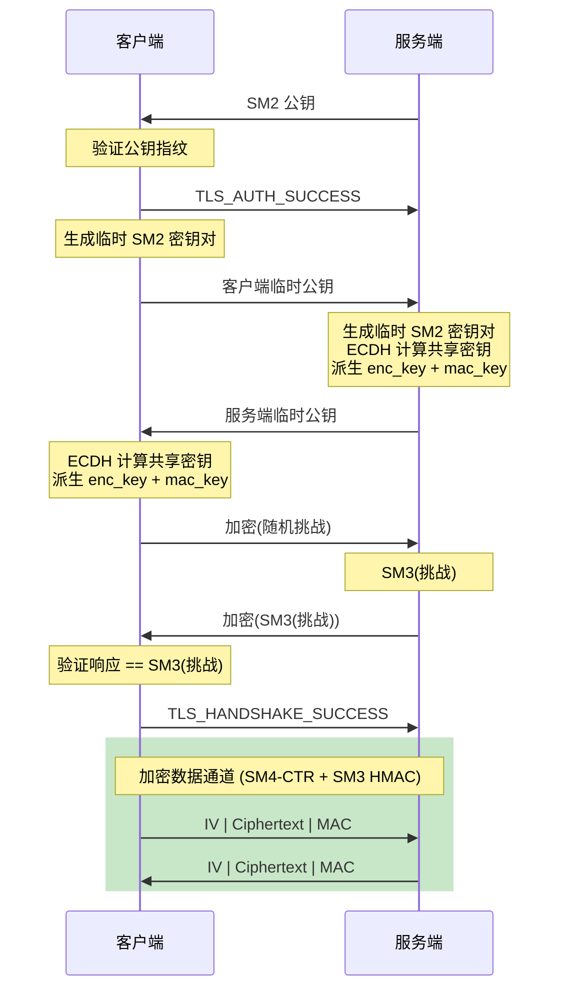

# simple_tls — 基于国密算法的简易 TLS 库

基于 GmSSL 的 SM2/SM3/SM4/ZUC 实现的轻量级安全通信库。

## 安全特性

+ **ECDH 密钥协商** — 前向保密，每次握手生成临时密钥对
+ **SM3 HMAC 消息完整性** — 每条消息附带 MAC 标签，防篡改
+ **SM4-CTR 加密** — 流加密模式，每条消息使用独立随机 IV
+ **挑战-响应握手验证** — 防止重放攻击

## 协议流程



## 消息格式

每条加密消息格式（hex 编码，`|` 分隔）：

```
<IV_hex>|<Ciphertext_hex>|<MAC_hex>
```

- **IV** — 16 字节随机初始化向量
- **Ciphertext** — SM4-CTR 加密的密文
- **MAC** — SM3 HMAC(IV + Ciphertext)，32 字节

## API

### `server` 类

| 方法 | 签名 | 说明 |
|------|------|------|
| `listen` | `(pkey_path, vkey_path, keypass, addr, port)` | 加载密钥并监听 |
| `fingerprint` | `() → string` | 返回公钥的 SM3 指纹（base64） |
| `accept` | `() → boolean` | 接受连接，执行握手。成功返回 `true` |
| `send` | `(data: string)` | 发送加密数据 |
| `receive` | `() → string` | 接收并解密数据（阻塞） |
| `receive_some` | `() → string or null` | 非阻塞接收，无数据返回 `null` |
| `available` | `() → boolean` | 是否有待接收数据 |
| `is_open` | `() → boolean` | 连接是否打开 |
| `close` | `()` | 关闭连接 |

| 属性 | 类型 | 说明 |
|------|------|------|
| `log` | `iostream` | 日志输出流（可选） |

### `client` 类

| 方法 | 签名 | 说明 |
|------|------|------|
| `connect` | `(addr, port) → boolean` | 连接服务端并执行握手 |
| `send` | `(data: string)` | 发送加密数据 |
| `receive` | `() → string` | 接收并解密数据（阻塞） |
| `receive_some` | `() → string or null` | 非阻塞接收 |
| `available` | `() → boolean` | 是否有待接收数据 |
| `is_open` | `() → boolean` | 连接是否打开 |
| `close` | `()` | 关闭连接 |

| 属性 | 类型 | 说明 |
|------|------|------|
| `authorized_keys` | `hash_set` | 授权公钥指纹集合 |
| `log` | `iostream` | 日志输出流（可选） |

## 使用示例

### 服务端

```covscript
import simple_tls as tls

var server = new tls.server
server.log = system.out
server.listen("server_pbk.pem", "server_pvk.pem", "password", "0.0.0.0", 1024)

if server.accept()
    var data = server.receive()
    server.send("Echo: " + data)
    server.close()
end
```

### 客户端

```covscript
import simple_tls as tls

var client = new tls.client
client.log = system.out
client.authorized_keys.insert("服务器公钥指纹(base64)")

if client.connect("127.0.0.1", 1024)
    client.send("Hello, Server!")
    var response = client.receive()
    client.close()
end
```

## 依赖

+ `gmssl` — 国密算法扩展
+ `network` — 网络通信
+ `codec.json` — JSON 编解码
